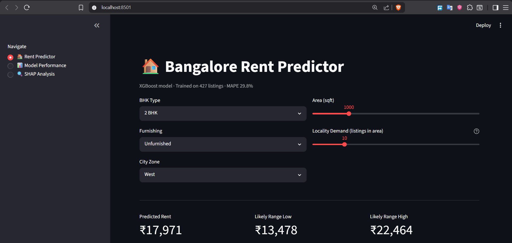
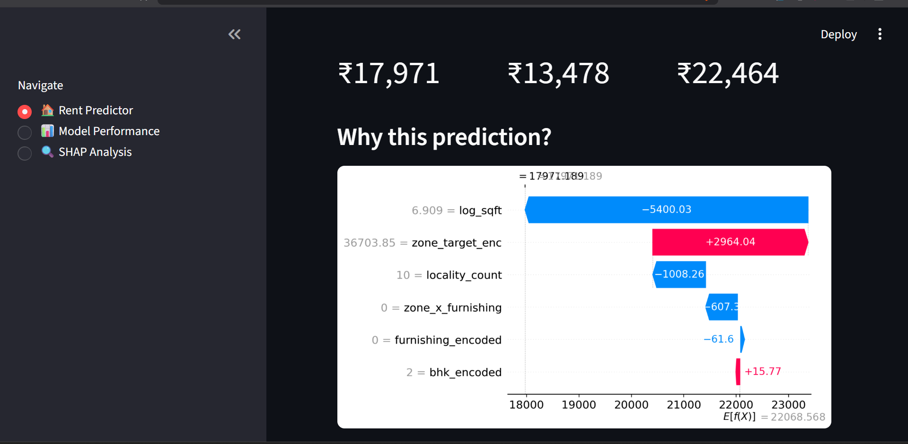
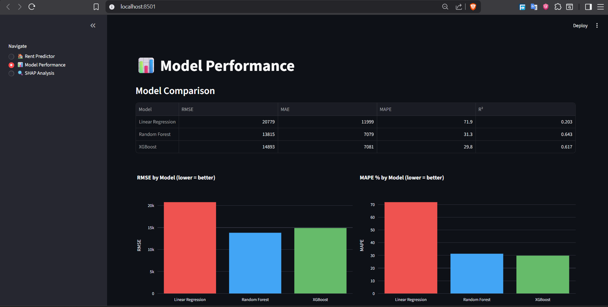
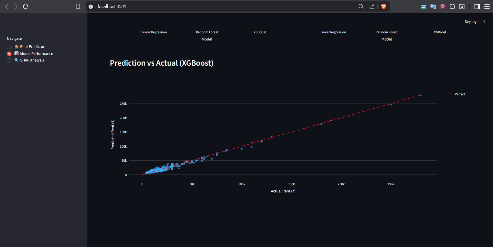
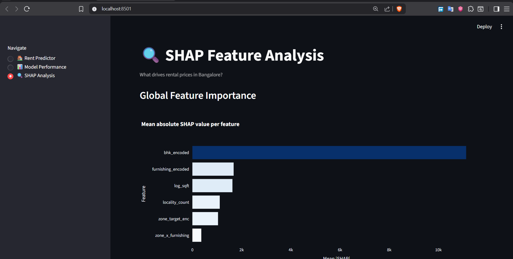
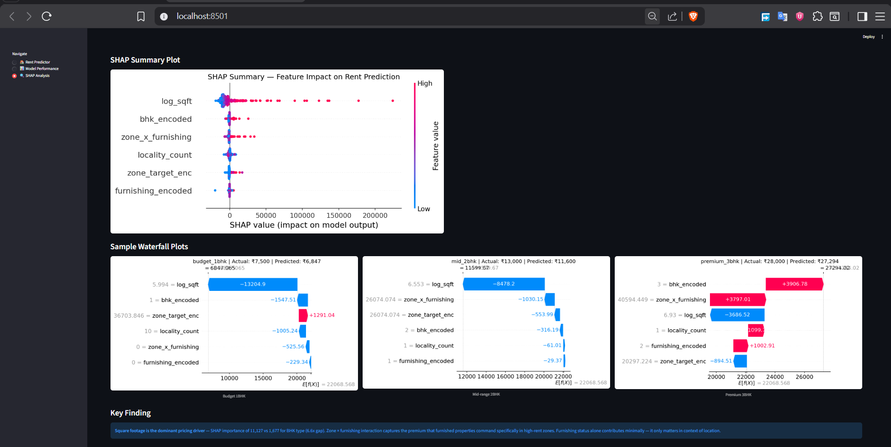

# 🏠 Bangalore Rental Price Predictor

> End-to-end ML pipeline predicting Bangalore rental prices with SHAP-based interpretability — 3-model comparison (Linear Regression, Random Forest, XGBoost) trained on 427 cleaned listings across 5 city zones.

**[🚀 Live Demo](https://renox23-bangalore-rental-predictor-ml.streamlit.app/)** · **[📊 DA Dashboard](https://renox23-bangalore-rental-dashboard.streamlit.app/)**

---



---

## Business Question

> *Which property features drive rental prices in Bangalore, and can we quantify their individual contribution?*

Not just predicting rent — explaining **why** the model predicts what it does, feature by feature.

---

## Key Findings

- **Square footage dominates** — SHAP importance of 11,127 vs 1,677 for BHK type (6.6x gap). Size is the single strongest pricing signal in Bangalore rentals
- **Furnishing only matters in context** — standalone SHAP of 362 (weakest feature), but zone × furnishing interaction scores 1,628 — a furnished flat in West Bangalore commands far more premium than the same in South
- **Linear models fail completely** — 71.9% MAPE vs 29.8% for XGBoost, confirming rent has strongly non-linear relationships with location and size
- **Model predicts within ₹4,500 on average** for a typical ₹15,000 flat (MAPE 29.8%) — honest limitation of 427-row dataset acknowledged

---

## Dashboard Pages

### 🏠 Rent Predictor
Input BHK type, furnishing, zone, sqft → get predicted rent + confidence range + live SHAP waterfall explaining the prediction



### 📊 Model Performance
3-model comparison table, RMSE/MAPE bar charts, prediction vs actual scatter





### 🔍 SHAP Analysis
Global feature importance, summary plot, sample waterfall plots for budget/mid/premium properties





---

## ML Pipeline

### Feature Engineering (8 features, all justified)

| Feature | Encoding | Reasoning |
|---|---|---|
| BHK Type | Ordinal (0–5) | Natural size order — preserve hierarchy |
| Furnishing | Ordinal (0–2) | Unfurnished → Semi → Furnished progression |
| Zone | Target encoded | Captures economic signal directly; one-hot loses pricing hierarchy |
| Locality | Target encoded + smoothing | 127 localities — one-hot creates 127 sparse columns |
| Area sqft | Log transform | Right-skewed distribution; log linearizes size-price relationship |
| Locality count | Raw count | Proxy for market liquidity and demand |
| Zone × Furnishing | Interaction term | Furnished premium is zone-dependent, not uniform |
| ~~Price per sqft~~ | **EXCLUDED** | Data leakage — derived from target variable |

### Model Comparison (5-fold CV)

| Model | RMSE | MAE | MAPE | R² |
|---|---|---|---|---|
| Linear Regression | ₹20,779 | ₹11,999 | 71.9% | 0.203 |
| Random Forest | ₹13,815 | ₹7,079 | 31.3% | 0.643 |
| **XGBoost** ✅ | **₹14,893** | **₹7,081** | **29.8%** | **0.617** |

XGBoost selected as final model — wins on MAPE (business-relevant metric). Random Forest wins RMSE but XGBoost generalizes better on percentage error across the rent range.

### Training Protocol
```
427 listings → 5-fold cross-validation → final model trained on full dataset
Test set touched ONCE for final evaluation
Target encoding computed inside CV folds — no data leakage
```

---

## SHAP Interpretability

SHAP (SHapley Additive Explanations) explains individual predictions — not just global feature importance.

**Global importance:**
```
log_sqft              11,127  ████████████████████████████████
bhk_encoded            1,677  ████
zone_x_furnishing      1,628  ████
locality_count         1,113  ██
zone_target_enc        1,042  ██
furnishing_encoded       363  █
```

**Sample waterfall interpretation (3BHK, Furnished, West zone):**
- Base prediction: ₹22,069
- BHK=3 adds: +₹3,907
- Zone×Furnishing adds: +₹3,797
- log_sqft subtracts: −₹3,687 (smaller than average for a 3BHK)
- Final prediction: ₹27,294 vs actual ₹28,000

---

## Stack

| Layer | Tool |
|---|---|
| Data | Public Bangalore rental dataset (886 listings → 427 after zone filtering) |
| Feature Engineering | Pandas, NumPy, scikit-learn |
| Modeling | scikit-learn, XGBoost |
| Interpretability | SHAP |
| Visualization | Plotly, Matplotlib |
| Dashboard | Streamlit |
| Deployment | Streamlit Cloud |

---

## Project Structure

```
bangalore-rental-ml/
├── data/
│   ├── listings_clean.csv      # Source data from DA project
│   └── features.csv            # Engineered feature matrix
├── src/
│   ├── feature_engineering.py  # Feature pipeline
│   ├── train.py                # 3-model CV training + serialization
│   └── explain.py              # SHAP analysis + plot generation
├── models/
│   ├── xgb_model.pkl           # Serialized XGBoost model
│   └── features_list.pkl       # Feature column order
├── dashboard/
│   └── app.py                  # 3-page Streamlit app
├── assets/                     # SHAP plots
├── screenshots/                # Dashboard previews
└── requirements.txt
```

---

## Setup

```bash
git clone https://github.com/RenoX23/bangalore-rental-ml
cd bangalore-rental-ml
python -m venv venv && venv\Scripts\activate
pip install -r requirements.txt
python src/feature_engineering.py
python src/train.py
python src/explain.py
streamlit run dashboard/app.py
```

---

## Limitations & Next Steps

**Current limitations:**
- 427 rows after zone filtering — small dataset increases variance in CV scores
- No geospatial features — metro proximity, distance to tech hubs would meaningfully improve predictions
- Zone-level target encoding, not locality-level — coarser than ideal

**If I had more data:**
- Locality-level target encoding with Bayesian smoothing
- Distance to nearest metro station (geospatial feature)
- Listing recency (days since posted)
- Hierarchical model treating zone as group-level effect

---

## Related Project

This project extends the **[Bangalore Rental Market Intelligence Dashboard](https://github.com/RenoX23/bangalore-rental-dashboard)** — which provides EDA, locality comparisons, and zone-level analysis on the same dataset.

---
